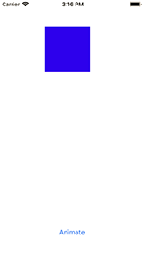

#Swift Recipes

References:
```bash
1. Swift Functional Programming
2. Programming in Smalltalk, TR87-023, April 15, 1987
3. https://theswiftdev.com/lazy-initialization-in-swift/
4. https://www.uraimo.com/2017/05/07/all-about-concurrency-in-swift-1-the-present/
5. http://www.thinkingparallel.com/2006/09/09/mutual-exclusion-with-locks-an-introduction/
6. https://www.baeldung.com/java-thread-safety
7. http://www.invasivecode.com/weblog/core-animation-part-ii-layers-everywhere/

```

```bash
1. Threading
2. NSOperationQueue
3. Functional Programming
4. Comparison
5. Data Types
6. Static Keyword
6. Property Observers
6. Protocols
7.1 Protocol Declaration
7.2 Protocol Extension
7.2.1 Protocol Extension - Computed Properties
8. Network
8.1 URLSession
8.2 URLRequest
8.3 URLSessionDataTask
9.2 Network Layer Design
10. Lazy Evaluation
11. Algorithms
11.1 Sorts
11.2 Search
11.3 FizzBuzz
12. Design Patterns
13.1 Singleton
14.2 Thread-safe Singleton
15. Properties
15.1 Stored Properties
15.2 Computed Properties
16 Strings
17 Arrays
18 Closures
19 KVO / KVC
20 UIKit
21 XCTest
22 XCUITest
```
1. Threading

Definitions

* Process - Process is the term for a program that is executing. 

* Thread - The term thread is a shortened version of "thread of execution". It refers to a path of execution of a program code. Each program has at least one thread which is called the main thread.

* Race Condition: 

* Deadlock: 

* Thread-safety: This means that multiple threads can access the same resource without causing unpredictable values or problematic program execution such as deadlock.


1.1 Command Line Threading - Linux
```bash
$ mkdir CLThread
$ cd CLThread
$ swift package init --type executable
```
In the code listing, the contents of the print statement will not appear on the screen if the 
main thread does not wait until the background thread has finished executing. Since the background thread does not block the main thread, 
control is returned immediately to the main thread. Without the sleep delay, the main thread has
no further task to perform and so the program exits before the background thread completes the for-in loop. As a result, the print statement
may not execute.

```swift
import Foundation

let bkgThread = Thread {
    for i in 0...100 {
        print("loop: \(i)")
    }
}
bkgThread.start()

// The main thread sleeps for 2 second 
// allowing time for the for-in loop to execute.
Thread.sleep(forTimeInterval: 2)
```

Another option is to use the RunLoop to keep the main thread running.
```swift
import Foundation

let bkgThread = Thread {
    for i in 0...100 {
        print("loop: \(i)")
    }
}
bkgThread.start()

// Keep the main thread alive so that the program does not exit.
RunLoop.current.run()
```

1.2 Basic Threading

1.2.1 Extending the Thread base class

Thread Properties
```swift
// Obtaining thread properties

import Foundation

class BasicThread: Thread {
    
    // Starting the thread executes the main function
    override func main() {
        print("Starting thread execution ...")
        Thread.sleep(forTimeInterval: 10)
        print("Thread slept for  10 seconds, and exited.")
    }
}

// Instantiating the thread
var basicThread = BasicThread()
print("Is main thread: \(basicThread.isMainThread)")

basicThread.name = "t1"
if let tid = basicThread.name {
    print("Thread id: \(tid)")
}

//basicThread.start()
```
Output:
```bash
Is main thread: false
Thread id: t1
```

Starting the Thread
```swift
// Executing the thread main function

import Foundation

class BasicThread: Thread {
    
    // Starting the thread executes the main function
    override func main() {
        print("Starting thread execution ...")
        Thread.sleep(forTimeInterval: 10)
        print("Thread slept for 10 seconds, and exited.")
    }
}

// Instantiating the thread
var basicThread = BasicThread()
print("Is main thread: \(basicThread.isMainThread)")

basicThread.name = "t1"
if let tid = basicThread.name {
    print("Thread id: \(tid)")
}

// Start thread execution
basicThread.start()
```
Output:
```bash
Is main thread: false
Thread id: t1
Starting thread execution ...
Thread slept for 10 seconds, and exited.
```

Main Thread Properties
```swift
import Foundation

class BasicThread: Thread {
    
    // Starting the thread executes the main function
    override func main() {
        print("Starting thread execution ...")
        Thread.sleep(forTimeInterval: 10)
        print("Thread slept for 10 seconds, and exited.")
    }
}

// Instantiating the thread
var basicThread = BasicThread()
print("Is main thread: \(basicThread.isMainThread)")

// Obtain main thread property
print("Main thread: \(Thread.isMainThread)")

basicThread.name = "t1"
if let tid = basicThread.name {
    print("Thread id: \(tid)")
}

// Start thread execution
basicThread.start()
```

Output:
```bash
Is main thread: false
Main thread: true
Thread id: t1
Starting thread execution ...
Thread slept for 10 seconds, and exited.
```

1.3 Thread Synchronization

Thread synchronization prevent corruption of data when that data is acted upon by multiple threads. The following software constructs facilitate thread synchronization: 
* Mutex / Locks - lock(), unlock()
* Semaphores - binary, counting
* Condition Variables
* Monitors - mutex + condition variable


1.3.1 Mutual Exclusion - mutex

A mutex is a object that can be used by a thread to prevent modification of code sections by another thread. It does this by providing a lock() and unlock() function. 

At the assembly language level, three steps are needed in order to increment the value of a variable. 
* Step 1 - Load the value from the variable's memory address into a CPU register.
* Step 2 - Increment the register value by 1
* Stpe 3 - Write the updated register value into the variable's memory address.
```bash
// Assembly pseudocode for incrementing i
mov i, R1
add 1, R1
mov R1, i
```
Increment variable on two threads without mutual exclusion.
```swift
// Increment variable on two threads

import Foundation

var sum = 0

var t1 = Thread {
    print("t1 initial sum: \(sum)")
    sum += 1
    print("t1 incremented sum: \(sum)")
}

var t2 = Thread {
    print("t2 initial sum: \(sum)")
    sum += 1
    print("t2 incremented sum: \(sum)")
}

t1.start()
t2.start()

// wait for t1 and t2 to complete
Thread.sleep(forTimeInterval: 4)
print("Final sum: \(sum)")
```
Output: 
```bash
t1 initial sum: 0
t2 initial sum: 0
t1 incremented sum: 2
t2 incremented sum: 2
Final sum: 2
```
Increasing the expected count to 2000.
```swift
// Increment variable on two threads

import Foundation

var sum = 0

var t1 = Thread {
    print("t1 initial sum: \(sum)")
    for _ in (0 ..< 1000) {
        sum += 1
    }
    print("t1 incremented sum: \(sum)")
}

var t2 = Thread {
    print("t2 initial sum: \(sum)")
    for _ in (0 ..< 1000) {
        sum += 1
    }
    print("t2 incremented sum: \(sum)")
}

t1.start()
t2.start()

// main thread sleeps
Thread.sleep(forTimeInterval: 4)
print("Final sum: \(sum)")
```
```bash
t1 initial sum: 0
t2 initial sum: 0
t1 incremented sum: 1895
t2 incremented sum: 1997
Final sum: 1997
```

Implementing Mutual Exclusion with NSLock
* Only one thread at a time can acquire the lock.
* Only the thread acquired the lock can perform unlock.
* Other threads will be blocked until the thread in unlocked.
* Locks are <em>unfair</em>. Acquiring the lock is not based on any order.

```swift
// Increment variable on two threads with mutual exclusion
// to obtain the expected value of sum.

import Foundation

var sum = 0
let nslock = NSLock()

var t1 = Thread {
    print("t1 initial sum: \(sum)")
    nslock.lock()

    // increment sum 1000 times
    for _ in (0 ..< 1000) {
        sum += 1
    }
    nslock.unlock()
    print("t1 incremented sum: \(sum)")
}

var t2 = Thread {
    print("t2 initial sum: \(sum)")
    nslock.lock()

    // increment sum 1000 times
    for _ in (0 ..< 1000) {
        sum += 1
    }
    nslock.unlock()
    print("t2 incremented sum: \(sum)")
}

t1.start()
t2.start()

// main thread sleeps
Thread.sleep(forTimeInterval: 4)
print("Final sum: \(sum)")
```
Output:
```bash
t1 initial sum: 0
t2 initial sum: 0
t1 incremented sum: 1000
t2 incremented sum: 2000
Final sum: 2000
```

Subclassing Thread class
```swift
import Foundation

var sum = 0
let nslock = NSLock()

// subclassing requires overriding main()
class MyThread: Thread {
    var myText: String
    
    init(myText: String) {
        self.myText = myText
    }
    
    override func main() {
        print("\(myText) \(sum)")
        nslock.lock()
        
        // increment sum 1000 times
        for _ in (0 ..< 1000) {
            sum += 1
        }
        nslock.unlock()
        print("t1 incremented sum: \(sum)")
    }
}

var t2 = Thread {
    print("t2 initial sum: \(sum)")
    nslock.lock()
    
    // increment sum 1000 times
    for _ in (0 ..< 1000) {
        sum += 1
    }
    nslock.unlock()
    print("t2 incremented sum: \(sum)")
}

let t1 = MyThread(myText: "t1 initial sum:")
t1.start()
t2.start()

// main thread sleeps
Thread.sleep(forTimeInterval: 4)
print("Final sum: \(sum)")
```
Output:
```bash
t1 initial sum: 0
t2 initial sum: 0
t2 incremented sum: 1000
t1 incremented sum: 2000
Final sum: 2000
```

1.3.2 Recursive Lock - NSRecursive Lock

Unlike NSLock, NSRecursive lock allows the same thread to acquire the lock multiple times without creating a deadlock condition.
```swift
import Foundation

let recursiveLock = NSRecursiveLock()
var a = 2
var b = 4
var sum = 0

func product() {
    recursiveLock.lock()
    print("Acquiring lock again.")
    sum += a * b
    recursiveLock.unlock()
    print("Function releases lock.")
}

var thread = Thread {
 
    print("Thread acquires lock.")
    recursiveLock.lock()
    sum += a + b
    product()
    recursiveLock.unlock()
    print("Thread execution is complete.")
}

thread.start()
Thread.sleep(forTimeInterval: 3)
print("Sum: \(sum)")
```

1.3.3 NSConditionLock

NSConditionLock object can be used to acquire and release a lock when program defined conditions are met. Condition is of type Int.

Declaration
```bash
class NSConditionLock: NSObject
```
```swift
import Foundation

let EMPTY = 0
let FULL = 5

let fuelTank = NSConditionLock(condition: EMPTY)
var fuelQuantity = 0

class FuelThread: Thread {
    
    override func main(){
 
        print("Filling the tank ...")
        fuelTank.lock(whenCondition: EMPTY)         // Acquire the lock when condition is EMPTY
        
        for gallon in 1 ..< 6 {
            print("Fuel quantity: \(gallon)")
            fuelQuantity = gallon
        }
        print()
        fuelTank.unlock(withCondition: FULL)        // Release the lock and set the condition to FULL
 
    }
}

class DriveThread: Thread {
    
    override func main(){
        print("Waiting for fuel ...")
        fuelTank.lock(whenCondition: FULL)          // Acquire the lock when condition is FULL
        
        for miles in 1 ..< 6 {
            fuelQuantity -= 1
            print("Miles driven: \(miles), fuel remaining: \(fuelQuantity)")
 
        }
        print()
        fuelTank.unlock(withCondition: EMPTY)       // Release the lock and set the condition to EMPTY
    }
}

let fueling = FuelThread()
let driving = DriveThread()

fueling.start()
driving.start()
```

1.3.4 NSCondition

> "A condition object acts as both a lock and a checkpoint in a given thread. The lock protects your code while it tests the condition and performs the task triggered by the condition. The checkpoint behavior requires that the condition be true before the thread proceeds with its task. While the condition is not true, the thread blocks. It remains blocked until another thread signals the condition object." 

```swift
import Foundation

let condition = NSCondition()
var readyState = false
var bulletCount = 0

class MazagineLoader: Thread {
 
    override func main() {
        print("Magazine is Loading ...")
        
        condition.lock()
        while readyState == true {
            condition.wait()
        }
        
        for _ in (0 ..< 20) {
            bulletCount += 1
            print("loader - bullet count: \(bulletCount)")
            
            if bulletCount % 10 == 0 {
                readyState = true
                condition.signal()
                condition.unlock()
                break
            }
        }
    }
}

class Cannon: Thread {
    
    override func main() {
        condition.lock()
        while readyState == false {
            print("Cannon is waiting ...")
            condition.wait()
        }
        
        print("Cannon is Firing ...")
        for _ in (0 ..< 5) {
            bulletCount -= 1
            print("cannon - bullet count: \(bulletCount)")
        }
        readyState = false
        condition.unlock()
    }
}

let loader = MazagineLoader()
let cannon = Cannon()
loader.start()
cannon.start()
```
Output:
```bash
Magazine is Loading ...
Cannon is waiting ...
loader - bullet count: 1
loader - bullet count: 2
loader - bullet count: 3
loader - bullet count: 4
loader - bullet count: 5
loader - bullet count: 6
loader - bullet count: 7
loader - bullet count: 8
loader - bullet count: 9
loader - bullet count: 10
Cannon is Firing ...
cannon - bullet count: 9
cannon - bullet count: 8
cannon - bullet count: 7
cannon - bullet count: 6
cannon - bullet count: 5
```


1.3.2 Semaphore

Semaphores, developed by Dijkstra, provides <em>access control</em> to shared data. Semaphores are of two forms, Binary Semaphores and Counting Semaphores.
Binary semaphore has a value that can range between 0 and 1. In this case the semaphore acts like a mutex lock. Counting semaphore is used to control access to resource that has multiple instances.

Semaphores increment and decrement an integer value in order to provide access control of code blocks which are all described by the term critical section. In the case of a mutex only the thread that has acquired the lock, can release the lock. In the case of semaphores, however, if the count is greater that zero any thread can increment or decrement the semaphore count. Essential, mutexes allow only one thread to acquire a resource. Semaphores allow multiple threads to acquire resources if the resources are available.

Issues with Semaphore
Deadlock - 


1.3.3 DispatchSemaphore instead of NSLock
```swift
// Replacing NSLock with DispatchSemaphore

import Foundation

var sum = 0

// Only one thread can access the resource, sum
let semaphore = DispatchSemaphore(value: 1)
// let nslock = NSLock()

var t1 = Thread {
    print("t1 initial sum: \(sum)")
   // nslock.lock()

    // wait requests the resource
    semaphore.wait()    // value-- = 1 locks resource, sum
    
    // increment sum 1000 times
    for _ in (0 ..< 1000) {
        sum += 1
    }
    //nslock.unlock()

    // signal releases the resource
    semaphore.signal()  // value++ = 1
    print("t1 incremented sum: \(sum)")
}

var t2 = Thread {
    print("t2 initial sum: \(sum)")
    //nslock.lock()
    semaphore.wait()    // wait results in value-- = 0 creating a lock on sum
    
    // increment sum 1000 times
    for _ in (0 ..< 1000) {
        sum += 1
    }
    //nslock.unlock()
    semaphore.signal() // value++ makes resource available to other threads
    print("t2 incremented sum: \(sum)")
}

t1.start()
t2.start()

// main thread sleeps
Thread.sleep(forTimeInterval: 4)
print("Final sum: \(sum)")
```

1.3.4 T2 Waits For T1 To Signal

```swift
import Foundation

var buffer: [Int] = []

// One thread has to increment value to 1
let semaphore = DispatchSemaphore(value: 0)

var t1 = Thread {
    print("t1 is adding to the buffer.")
    
    // append to buffer 10 times
    for item in (0 ..< 10) {
        buffer.append(item)
        print("item: \(item)")
    }
    
    print("t1 sent signal.")
    semaphore.signal()
}

// t2 waits for the semphore value to be incremented
var t2 = Thread {
    
    print("t2 is waiting for a full buffer.")

    // Value has to be greater than 0 for code execution
    semaphore.wait()
    
    var j = 0
    while j < buffer.count {
        print("buffer: \(buffer[j])")
        j += 1
    }
    print("t2 read the last item.")
}

t1.start()
t2.start()
```
First Run:
```bash
t1 is adding to the buffer.
item: 0
item: 1
item: 2
item: 3
item: 4
item: 5
item: 6
item: 7
item: 8
item: 9
t1 sent signal.
t2 is waiting for a full buffer.
buffer: 0
buffer: 1
buffer: 2
buffer: 3
buffer: 4
buffer: 5
buffer: 6
buffer: 7
buffer: 8
buffer: 9
t2 read the last item.
```

Second Run:
```bash
t1 is adding to the buffer.
t2 is waiting for a full buffer.
item: 0
item: 1
item: 2
item: 3
item: 4
item: 5
item: 6
item: 7
item: 8
item: 9
t1 sent signal.
buffer: 0
buffer: 1
buffer: 2
buffer: 3
buffer: 4
buffer: 5
buffer: 6
buffer: 7
buffer: 8
buffer: 9
t2 read the last item.
```

1.3.5 Consuming the Buffer
```swift
import Foundation

var buffer: [Int] = []

// Signal required to increment value
let semaphore = DispatchSemaphore(value: 0)

var t1 = Thread {
    print("t1 is adding to the buffer.")
    
    // append to buffer 10 times
    for item in (0 ..< 10) {
        buffer.append(item * 10)
        print("item: \(buffer[item])")
    }
    
    print("t1 sent signal.")
    semaphore.signal()
}

// t2 waits for the semphore value to be incremented
var t2 = Thread {
    
    print("t2 is waiting for a full buffer.")
    semaphore.wait()
    
    let j = 0
    while buffer.count > 0 {
        print("buffer[0]: \(buffer[j]), buffer size = \(buffer.count)")
        buffer.remove(at: j)
    }
    print("buffer is empty.")
}

t1.start()
t2.start()
```

```bash
t1 is adding to the buffer.
t2 is waiting for a full buffer.
item: 0
item: 10
item: 20
item: 30
item: 40
item: 50
item: 60
item: 70
item: 80
item: 90
t1 sent signal.
buffer[0]: 0, buffer size = 10
buffer[0]: 10, buffer size = 9
buffer[0]: 20, buffer size = 8
buffer[0]: 30, buffer size = 7
buffer[0]: 40, buffer size = 6
buffer[0]: 50, buffer size = 5
buffer[0]: 60, buffer size = 4
buffer[0]: 70, buffer size = 3
buffer[0]: 80, buffer size = 2
buffer[0]: 90, buffer size = 1
buffer is empty.
```


Thread-safe Design

1. Stateless Implementation 

As long as a computation is not dependent on any outside value to arrive at a result, then that computation is thread-safe. The examples below demonstrate thread-safe computation of two Fibonacci values on separate threads.

The Fibonacci examples below demonstrate that the computations are independent of each other and so the fibonacci function is thread-safe. However, using separate threads to compute the Fibonacci of two numbers is very inefficient as each Fibonacci value has to be re-computed on each thread as can be seen in the example output.
```bash
t2 started ... compute fib 9
t1 started ... compute fib 8
F[2]: 1  // t1 - typical
F[2]: 1  // t2 - typical

F[3]: 2
F[3]: 2

F[4]: 3
F[4]: 3

F[5]: 5
F[5]: 5

F[6]: 8
F[6]: 8

F[7]: 13
F[8]: 21

F[7]: 13
F[9]: 34
F[8]: 21
Fibonacci of 10: 55
```

1.1 Fibonacci on Multiple Threads
```swift
import Foundation

var fib9: Int = 0
var fib8: Int = 0

func fibonacci(n: Int) -> Int {
    if n < 2 {
        return n
    }
    return fibonacci(n: n - 1) + fibonacci(n: n - 2)
}

let t1 = Thread {
    print("t1 started ... compute fib 8")
    fib8 = fibonacci(n: 8)
}

let t2 = Thread {
    print("t2 started ... compute fib 9")
    fib9 = fibonacci(n: 9)
}

t1.start()
t2.start()

// Wait for threads to complete
Thread.sleep(forTimeInterval: 4)

let fib10 = fib9 + fib8
print("fib 10: \(fib8 + fib9)")
```

Output:
```bash
t1 started ... compute fib 8
t2 started ... compute fib 9
fib 10: 55
```

1.2 Fibonacci with Memoizaton

```swift
import Foundation

var fib9: Int = 0
var fib8: Int = 0

// memoization using an array
func fibonacci(_ n: Int) -> Int {
    if n < 2 {
        return n
    }
    
    var F:[Int] = []
    
    // initialize from 0 ... n
    for _ in (0 ... n) {
        F.append(-1)
    }
    
    F[0] = 0
    F[1] = 1
    
    var j = 2
    while j <= n {
        
        F[j] = F[j - 1] + F[j - 2]
        print("F[\(j)]: \(F[j])")
       j = j + 1
    }
    return F[n]
}

let t1 = Thread {
    print("t1 started ... compute fib 8")
    fib8 = fibonacci(8)
}

let t2 = Thread {
    print("t2 started ... compute fib 9")
    fib9 = fibonacci(9)
}

t1.start()
t2.start()

//Thread.sleep(forTimeInterval: 4)
DispatchQueue.main.asyncAfter(deadline: .now() + .seconds(1), execute: {
    print("Fibonacci of 10: \(fib8 + fib9)")
})
```
Output:

```bash
t2 started ... compute fib 9
t1 started ... compute fib 8
F[2]: 1
F[2]: 1
F[3]: 2
F[3]: 2
F[4]: 3
F[4]: 3
F[5]: 5
F[5]: 5
F[6]: 8
F[6]: 8
F[7]: 13
F[8]: 21
F[7]: 13
F[9]: 34
F[8]: 21
Fibonacci of 10: 55
```

2. NSOperationQueue
```swift
// Basic OperationQueue

import Foundation

class NetworkTask: Operation {
    override func main() {
        print("Executing a network task.")
    }
}

class ImageFilterTask: Operation {
    override func main() {
        print("Executing an image filter task.")
    }
}

let networkTask = NetworkTask()
let filterImageTask = ImageFilterTask()

networkTask.completionBlock = {
    print("Network task is complete.")
}

filterImageTask.completionBlock = {
    print("Image filter task is complete.")
}

let queue = OperationQueue()
queue.addOperation(networkTask)
queue.addOperation(filterImageTask)
```
Output:
```bash
Executing a network task.
Executing an image filter task.
Image filter task is complete.
Network task is complete.
```

3. Functional Programming
3.1 Higher Order Function

These are functions that take a function as the argument or that return a function as the result.

* .map {}
* .flapMap {}
* .compactMap {}
* .reduce {}
* .filter {}
* .sorted {}
* .forEach {}


Reduce
```swift
// Sum array elements using higher order function

let score = [17, 3, 22, 19, 42]
let sum = score.reduce(0, +)
```

3. Comparsions

3.1 Optional Binding vs Optional Chaining

3.2. ViewController vs View
ViewControllers are classes with a lifecycle. The View, however, is a canvas for displaying UI components.

3.3 try vs try? vs try!

3.4 as vs as? vs as!

3.5 Stored vs Computed Properties

3.6 Any vs Any? vs Any!

3.6 Any vs AnyObject


3.7 [String()] vs `[String]()`

[String()] - Is an array that can contain elements of type String. The array currenty has one empty String element.

`[String]()` - Declares a new empty array that can contain elements of type String.
```swift
import Foundation

var item = [String()]
var elem = [String]()

print(type(of: item))
print(type(of: elem))

print("item contents: \(item)")
print("elem contents: \(elem)")
```
Output:
```bash
Array<String>
Array<String>
item contents: [""]
elem contents: []
```

3.8 Protocols vs Class
Protocols provide abstract declarations of properties and methods. Classes, provide concrete implementation of the abstruct declarations in protocols.

3.9 Class property vs Static property
A class property can be overridden in a subclass. Static property cannot be overridden.

3.10 static let vs static var
Both <em>static let</em> and <em>static var</em> are type properties and cannot be modified by instances of the type. Properties with <em>static let</em> declaration are read-only type properties. Properties with <em>static var</em> declaration are read-write type properties.
```swift
enum Insole {
    case soft
    case medium
    case firm
}

struct RunningShoes {
    static let brand = "RoundRock"
    static var terrain = "Rough Track"
    var size = Int()
    var cleats: String?
    let insole: Insole = .firm 
}
```

3.9 Static Dispatch vs Dynamic Dispatch


3.10 let vs var
// memory location allocation
// memory footprint


3.x static let vs static var

both static let and static var declare properties that are available to all objects of a type. Both static let and static var are known as type properties. Static properties are accessed directly on the type without creating an instance of the type.

```swift
    struct Aircraft {
    static let maxWeight: Int = 30_000
    static var grossWeight: Int
}

let aircraft = Aircraft(grossWeight: 20_000)
let maxWeight = aircraft.maxWeight
```


3.10 Frame vs Bounds

The frame of a view refers to the view's coordinate as related to its superview.

```swift
// Typical use
self.window.frame = UIScreen.bounds
```

This code works:
```swift
    self.blueView.frame = CGRect(x: 100, y: 300, width: 100, height: 100)
```

This code works:
```swift
    self.blueView.bounds = CGRect(x: 0, y: 0, width: 100, height: 100)
```

This code does not:
```swift
    self.blueView.bounds = CGRect(x: 100, y: 300, width: 100, height: 100)
```

3.x static let / static var setters and getters

Getters must always be included.

```swift
struct Aircraft {
    
    static let maxWeight: Int = 20_000
    static let tareWeight: Int = 5_000
    static var cargoWeight: Int = 0
    
    static var grossWeight: Int {
        get {
            return tareWeight + cargoWeight
        }
        set {
            cargoWeight = newValue - tareWeight
        }
    }
}

override func viewDidLoad() {
    super.viewDidLoad()
    Aircraft.grossWeight = 15_000
    print("cargo weight: \(Aircraft.cargoWeight)")
}
```


4. Data Types

4.1 Int / UInt
4.2 Float
4.3 Double
4.4 Bool
4.5 String
4.6 Character


4.7 Optional Data Type

```swift
enum Optional {
    case some(Wrapped)
    case none
}
```

Declaration
```swift
@frozen enum Optional<Wrapped>      /* frozen as immutable in the future */
```

Optional type used as an enum with cases some(Wrapped) and none.
```swift
let midName: Optional<String> = nil

// Optional binding of wrapped value midName to name using "if let"
if let name = midName {
    print("name: \(name)")
} else {
    print("No middle name.")
}

let firstName: String? = Optional.some("Mary")
if let firstName = firstName {
    print("first name: \(firstName)")
}

let lastName: String? = Optional.none
if let lastName = lastName {
    print("last name: \(lastName)")
} else {
    print("No last name.")
}

// Optional binding of wrapped value using "guard let"
func showMidName(_ midName: Optional<String>) {

    guard let name = midName else {
        print("No middle name.")
        return
    }
    print("name: \(name)")
}
showMidName(nil)

// Guard let using none-void return value
func showMidName(_ midName: Optional<String>) -> String {

    guard let name = midName else {
        return "No middle name"
    }
    return name.uppercased()
}

var name: String = showMidName("Warner")
print("name: \(name)")
```

Using guard let Optional binding in a class method
```swift
class Freshman {
    
    var id: Int
    var firstName: String
    var midName: String? = nil
    var lastName: String
 
    
    // title is read-only property
    var title: String {
        return "Freshman"
    }
    
    init(id: Int, firstName: String, midName: String?, lastName: String) {
        self.id = id
        self.firstName = firstName
        self.midName = midName
        self.lastName = lastName
    }
    
    convenience init(id: Int, firstName: String, lastName: String) {
        self.init(id: id, firstName: firstName, midName: nil, lastName: lastName)
    }
    
    func fullName() -> String {
        guard let midName = midName else {
            return firstName + " " + lastName
        }
        return firstName + " " + midName + " " + lastName
    }
}

// Case - 1: All three names are available
let freshman = Freshman(id: 1, firstName: "Willy", midName: "James", lastName: "Escobar")
print("Title: \(freshman.title) - Full name: \(freshman.fullName())")


// Case - 2: Only first and last names are available
let freshman2 = Freshman(id: 2, firstName: "Jackie", lastName: "Kruger")
print("Title: \(freshman2.title) - Full name: \(freshman2.fullName())")
```

Long form of type Optional shows that Optional types are generic data types. The wrapped type in the example below is of type String.
```swift
let midName: Optional<String> = nil

if let name = midName {
    print("name: \(name)")
} else {
    print("No middle name.")
}
```

Shortened form of type Optional.
```swift
let midName: String? = nil

if let name = midName {
    print("name: \(name)")
} else {
    print("No middle name.")
}
```
4.8 Tuple

5. Protocols

Per Apple's Swift Programming Languge Guide - A protocol defines a blueprint of methods, properties, and other requirements that suit a particular task or piece of functionality. Going back to Objective-C root language Smalltalk "...groups of operations are called protocols".

Subclassing provides and inheritance class hierarchy relationship between classes. A child class inherits all the properties, methods and class initializers of its parent class. Note that a struct can conform to protocols thus giving it features similar to classes. Structs however and be passed in to functions as value types thus reducing side-effects.

5.1 Property requirements for Protocol Declaration

* Property type
* Property is read only / read-write { get set } property
* Property is stored / computed type
* Static modifier where applicable

5.2 Method Requirements for Protocol Declaration

* Cannot have default parameter values
* Static modifier where applicable

```swift
/*
* Mutating - Prefix a method with keyword "mutating" if the 
* method within the struct can modify struct instance properties. 
*/

import Foundation

protocol ColorPalet {
    var sheetColor: String { get set }
    
    mutating func updateColorPref(sColor: String) -> String
}

struct myPalet: ColorPalet {
    var sheetColor: String
    
    mutating func updateColorPref(sColor: String) -> String {
        sheetColor = sColor + " Green"
        return sheetColor
    }
}

var colorPalet = myPalet(sheetColor: "Satin ")
let color = colorPalet.updateColorPref(sColor: "Blue")
print(color)
```


5.3 Optional property and functions in Protocols

```swift
// UIColor extension:
// https://stackoverflow.com/questions/44672594/is-it-possible-to-get-color-name-in-swift

import UIKit

extension UIColor {
    var name: String? {
        switch self {
            case UIColor.black: return "black"
            case UIColor.darkGray: return "darkGray"
            case UIColor.lightGray: return "lightGray"
            case UIColor.white: return "white"
            case UIColor.gray: return "gray"
            case UIColor.red: return "red"
            case UIColor.green: return "green"
            case UIColor.blue: return "blue"
            case UIColor.cyan: return "cyan"
            case UIColor.yellow: return "yellow"
            case UIColor.magenta: return "magenta"
            case UIColor.orange: return "orange"
            case UIColor.purple: return "purple"
            case UIColor.brown: return "brown"
            default: return nil
        }
    }
}

// Protocol optional property and method
@objc protocol CarProtocol {
    var make: String { get set }
    var model: String { get set }
    var color: UIColor { get set }
    @objc optional var cylinders: Int { get set }
    
    func drive()
    @objc optional func race()
}

class Sedan: CarProtocol {
    var make: String
    var model: String
    var color: UIColor
    
    init(make: String, model: String, color: UIColor) {
        self.make = make
        self.model = model
        self.color = color
    }
    
    func drive() {
        print("I am driving the \(color.name ?? "") company car of make \(make) and model \(model).")
    }
}

class SportCar: CarProtocol {
    var make: String
    var model: String
    var cylinders: Int
    var color: UIColor
    
    init(make: String, model: String, cylinders: Int, color: UIColor) {
        self.make = make
        self.model = model
        self.cylinders = cylinders
        self.color = color
    }
    
    func drive() {
        print("I am driving the \(color.name ?? "") company car of make \(make) and model \(model).")
    }
    
    func race() {
        print("I am racing the \(color.name ?? "") car of make \(make) and model \(model) with \(cylinders) cylinders.")
    }
}

let companyCar = Sedan(make: "Ford", model: "Fiesta", color: .white)
companyCar.drive()

let sportCar = SportCar(make: "Jaguar", model: "XJR", cylinders: 8, color: .green)
sportCar.race()
```

5.4 Protocol as Type
```swift
import Foundation

enum Powertrain {
    case gasoline
    case diesel
    case electric
    case hybrid
}

protocol Vehicle {
    var make: String { get set }
    var model: String { get set }
    var powertrain: Powertrain { get set }
    init(make: String, model: String, powertrain: Powertrain)
}

final class Sedan: Vehicle {
    var make: String
    var model: String
    var powertrain: Powertrain
    
    init(make: String, model: String, powertrain: Powertrain) {
        self.make = make
        self.model = model
        self.powertrain = powertrain
    }
}

class SUV: Vehicle {
    var make: String
    var model: String
    var powertrain: Powertrain
    
    // non-final class can only be satified by a required initializer
    required init(make: String, model: String, powertrain: Powertrain) {
        self.make = make
        self.model = model
        self.powertrain = powertrain
    }
}

class Truck: Vehicle {
    var make: String
    var model: String
    var powertrain: Powertrain
    
    // non-final class can only be satified by a required initializer
    required init(make: String, model: String, powertrain: Powertrain) {
        self.make = make
        self.model = model
        self.powertrain = powertrain
    }
}

func makeVehicle() {
    let suv = SUV(make: "Rover Tierra", model: "Del Fuego", powertrain: .diesel)
    let sedan = Sedan(make: "AMC", model: "Gremlin", powertrain: .gasoline)
    let truck = Truck(make: "Tesla", model: "Cyber Truck", powertrain: .electric)
    let econo = Sedan(make: "EcoDrive", model: "E-20", powertrain: .hybrid)
    
    var vehicles: [Vehicle] = []
    vehicles.append(suv)
    vehicles.append(sedan)
    vehicles.append(truck)
    vehicles.append(econo)
    
    // Use is to filter vehicle type
    for vehicle in vehicles {
        if vehicle is Truck {
            print("Make: \(vehicle.make)")
        }
    }
    
   // Use where to filter vehicle type
    for vehicle in vehicles where vehicle is Sedan {
        print("Sedan: \(vehicle.model)")
    }
    
    // Downcasting parent type to Sedan type with as keyword
    for vehicle in vehicles {
        if let sedan = vehicle as? Sedan {
            print("Sedan - make: \(sedan.make), model: \(sedan.model), powertrain: \(sedan.powertrain) ")
        }
    }

   // Use is to filter type
    for vehicle in vehicles {
        if vehicle is Sedan {
            print("Sedan - make: \(vehicle.make), model: \(vehicle.model), powertrain: \(vehicle.powertrain) ")
        }
    }
}

makeVehicle()
```


x. Property Observers
x.1 WillSet
The <em>willSet</em> property observer is called just before the value is stored.

x.2 DidSet
The <em>didSet</em> property observer is called immediately after the value is stored.

Neither <em>willSet</em> or <em>didSet</em> is called during object initialization.


x. Static Keyword
x.1 static let / var

* "static let" defines a read-only type property. It is a property that cannot be changed by instances of a class or struct. However, it is a property that is available to all instances of the associated class or struct.

* "static var" defines a read-write type property. It is a property that is accessible to all instances of the associated class or struct. It can be described as global property associated with the class or struct type.

* Static members are associated with the class or struct type and can only be used on the type.

x.x Static Type Property - Class Declaration
```swift
import Foundation

enum EmployeeStatus {
    case FullTime
    case Intern
}

class Employee {
    static let company = "Acme Software"
    static var status = EmployeeStatus.FullTime
    
    var firstName = "Mary"
    var lastName = "Doe"
    var division = String()
    var department = String()
    var empID = String()
    let office = "Miami"
}

let employee = Employee()
employee.firstName = "Alexy"
employee.lastName = "Jones"
employee.division = "Engineering"
employee.department = "HR"
employee.empID = "092316EH"


// static member 'status' cannot be used on instance of type 'Employee'
// print("employee: \(employee.status)")

print("employee status: \(Employee.status)")

// static member 'company' cannot be used on instance of type 'Employee'
// print("employee: \(employee.company)")

print("employee company: \(Employee.company)")

// instance member 'office' cannot be used on type 'Employee'
// print("employee office: \(Employee.office)")

print("employee office: \(employee.office)")
```


x.2 Static Type Property - Struct Declaration
```swift
import Foundation

struct TaskFeature {
    static let department = "Engineering"
    static var name = "3D Path Plot"
    
    var taskLeader = String()
    var endDate: Date
    var laborHours: Int
    
    init(taskLeader: String, laborHours: Int, endDate: Date) {
        self.taskLeader = taskLeader
        self.laborHours = laborHours
        self.endDate = endDate
    }
    
}

let feature = TaskFeature(taskLeader: "Gary Wen", laborHours: 200, endDate: .init(timeIntervalSinceNow: 32000))

// Read static values
print("Department: \(TaskFeature.department)")
print("Feature name: \(TaskFeature.name)")

// Change static value
TaskFeature.name = "3D Path Plot - Update 1"
print("Feature name: \(TaskFeature.name)")
```

Output:
```bash
Department: Engineering
Feature name: 3D Path Plot
Feature name: 3D Path Plot - Update 1
```

x.x Static Type Property - Instance Usage
```swift
import Foundation

struct TaskFeature {
    static let department = "Engineering"
    static let featureUrl = "https://dev.acme.com/3d-path-plot"
    static var name = "3D Path Plot"
    
    var taskLeader = String()
    var endDate: Date
    var laborHours: Int
    
    init(taskLeader: String, laborHours: Int, endDate: Date) {
        self.taskLeader = taskLeader
        self.laborHours = laborHours
        self.endDate = endDate
    }
    
    func fetchTestData(urlString: String) {
        print("Fetch test data from url: \(urlString)")
    }
}

let feature = TaskFeature(taskLeader: "Gary Wen", laborHours: 200, endDate: .init(timeIntervalSinceNow: 3200))

// Read / Update static values
print("Department: \(TaskFeature.department)")
print("Feature name: \(TaskFeature.name)")

// Change feature name
TaskFeature.name = "3D Path Plot - Update 1"
print("Feature name: \(TaskFeature.name)")

// Use static type property
feature.fetchTestData(urlString: TaskFeature.featureUrl)
```
Output:
```bash
Department: Engineering
Feature name: 3D Path Plot
Feature name: 3D Path Plot - Update 1
Fetch test data from url: https://dev.acme.com/3d-path-plot
```


x. Class Keyword
x.1 class var

6. Network

6.1 HTTP Method

* Get
* Post
* Put
* Patch         // Analogous with update
* Delete

6.2 URLSession

6.3 URLRequest


7. Lazy Evaluation

7.1 Avoid using implicitly unwrapped optionals in UIKit ViewController
```swift
//  Use lazy var instead of implicity unwrapped optionals

import UIKit

class ViewController: UIViewController {
    
    lazy var label: UILabel = UILabel(frame: CGRect(x: 0, y: 0, width: 200, height: 21))

    override func loadView() {
        super.loadView()
        self.view.addSubview(self.label)
    }

    override func viewDidLoad() {
        super.viewDidLoad()
        // Do any additional setup after loading the view, typically from a nib.
        self.label.text = "Hello, World!"
        self.label.textColor = .black
        self.label.font = UIFont.systemFont(ofSize: 16, weight: .bold)
        self.label.center = CGPoint(x: 160, y: 285)
        self.label.textAlignment = .center
    }
}
```

Use the map function to multiple each value in an array by 3, then extract the last element. Eager evaluation results in all elements being processed
then the last element is returned.
```swift
let array = [11, 22, 33, 44]
let first = array.map({$0 * 3}).last!
print(first)
```

Use the map function to multiply only the last element in the array by 3, then return the last element. Lazy evaluation results in only the last element
being processed and returned.
```swift
let array = [1, 2, 3, 4]
let last = array.lazy.map({$0 * 3}).last!
print(last)
```

8. Algorithms

8.1 Sorting

8.1.1 Sort Copy of Input

Algorithm:
* Create an empty array named sorted.
* Find the smallest element in the input array.
* Remove the smallest element from the input array.
* Append this element to the sorted array.
* Repeat until there are no more elements in the input array.

<p align="center">
   
</p>

Consider input array = [4, 9, 2, 6, 5] <br/>

end of loop - 1: <br/>
input array = [4, 9, 6, 5] <br/>
sorted array =  [ 2 ] <br/>

end of loop - 2: <br/>
input array = [ 9, 6, 5] <br/>
sorted array = [ 2, 4 ] <br/>

end of loop - 3: <br/>
input array = [ 9, 6 ] <br/>
sorted array = [ 2, 4, 5 ] <br/>

end of loop - 4: <br/>
input array = [ 9 ] <br/>
sorted array = [ 2, 4, 5, 6 ] <br/>

end of loop - 5: <br/>
input array = [] <br/>
sorted array = [ 2, 4, 5, 6, 9] <br/>

```swift
/*
 Language: Swift 4.2
 
 Sort Algorithm:
 1. Create an empty array named sorted.
 2. Find the smallest element in the input array.
 3. Remove the smallest element from the input array.
 4. Append this element to the sorted array.
 5. Repeat until there are no more elements in the input array.
 
 Performance:
 Time complexity: O(n^2)
 Space complexity: O(n)
 
*/

import Foundation

func sort_copy(array: [Int]) -> [Int] {
    var copy = array
    var sorted: [Int] = []
    var minIndex: Int
    
    while copy.count > 0 {
        minIndex = 0
        for i in (0 ..< copy.count) {
            if copy[i] < copy[minIndex] {
                minIndex = i
            }
        }
        sorted.append(copy[minIndex])
        copy.remove(at: minIndex)
    }
    return sorted
}

let a = [7, 4, 9, 2]
let result = sort_copy(array: a)
print(result)
```

8.1.2 Generic type format of sort_copy function
```swift
/*
 * Generic typing of sort_copy function
 * Comparable protocol for less than '<' comparison
 */
func sort_copy<T: Comparable>(array: [T]) -> [T] {
    var copy = array
    var sorted: [T] = []
    var minIndex: Int
    
    while copy.count > 0 {
        minIndex = 0
        for i in (0 ..< copy.count) {
            if copy[i] < copy[minIndex] {       // Comparable protocol
                minIndex = i
            }
        }
        sorted.append(copy[minIndex])
        copy.remove(at: minIndex)
    }
    return sorted
}

let a = [7, 4, 9, 2]
let result = sort_copy(array: a)
print(result)
```

8.1.3 Selection Sort

Algorithm <br/>
1. Compare element at index 0 with element at index 1 <br/>
1.1. If element at index 1 is less than element at index 0, swap the elements <br/>
1.2. Else, compare element at index 0 with element at index 2 ... array length <br/>

2. Compare element at index 1 with element at index 2 <br/>
2.1. If element at index 2 is less than element at index 1, swap the elements <br/>
2.2. Else, compare element at index 1 with element at index 3 ... array length <br/>

3. Compare element at index with element at index + 1 until to the array length <br/>

<p align="center">
   
</p>

Consider, input array = [25, 13, 41, 32, 66, 14, 50]

loop - 1: <br/>
25 and 13 are swapped <br/>
a = [13, 25, 41, 32, 66, 14, 50] <br/>

loop - 2: <br/>
25 and 14 are swapped <br/>
a = [13, 14, 41, 32, 66, 25, 50] <br/>

loop - 3: <br/> 
41 and 25 are swapped <br/>
a = [13, 14, 25, 32, 66, 41, 50] <br/>

loop - 4: <br/>
32 needs no swap <br/>
a = [13, 14, 25, 32, 66, 41, 50] <br/>

loop - 5: <br/>
66 and 41 are swapped <br/>
a = [13, 14, 25, 32, 41, 66, 50] <br/>

loop - 6: <br/>
66 and 50 are swapped <br/>
a = [13, 14, 25, 32, 41, 50, 66] <br/>

```swift
/*
 * Selection Sort Algorith
 *
 * Programming language: Swift 4.2
 */

func sort_selection(_ array: inout [Int]) {
    var temp: Int
    
    for i in (0 ..< array.count - 1) {
        for j in ( i+1 ..< array.count) {
            if array[j] < array[i] {
                temp = array[i]
                array[i] = array[j]
                array[j] = temp
            }
        }
    }
}

var a = [43, 11, 8, 23, 9]
sort_selection(&a)
print(a)
```

8.1.4 Selection Sort - Generic, Version 1
```swift
func sort_selection<T: Comparable>(_ array: inout [T]) {
    var temp: T
    
    for i in (0 ..< array.count - 1) {
        for j in (i + 1 ..< array.count) {
            if array[j] < array[i] {
                temp = array[i]
                array[i] = array[j]
                array[j] = temp
            }
        }
    }
}

var a = [40, 11, 8, 23, 9]
sort_selection(&a)
print(a)
```

8.1.5 Selection Sort - Generic, Version 2
```swift
func sort_selection<T: Comparable>(_ array: inout [T]) {
    var temp: T
    var j: Int
    
    for i in (0 ..< array.count - 1) {
        j = i + 1
        while ( j < array.count) {
            if array[j] < array[i] {
                temp = array[i]
                array[i] = array[j]
                array[j] = temp
            }
            j += 1
        }
    }
}

var a = [11, 11, 8, 23, 9]
sort_selection(&a)
print(a)
```

8.1.6 Insertion Sort
```swift
func insertion_sort(_ array: inout [Int]) {
    var temp: Int
    var j: Int
    
    for i in (1 ..< array.count) {
        j = i
        while array[j - 1] > array[j] {
            temp = array[j]
            array[j] = array[j - 1]
            array[j - 1] = temp
            j -= 1
        }
    }
}

var a = [ 9, 36, 21, 22, 16, 10]
insertion_sort(&a)
print(a)
```

8.1.7 Insertion Sort - Generic
```swift
func insertion_sort<T: Comparable>(_ array: inout [T]) {
    var temp: T
    var j: Int
    
    for i in (1 ..< array.count) {
        j = i
        while array[j - 1] > array[j] {
            temp = array[j]
            array[j] = array[j - 1]
            array[j - 1] = temp
            j -= 1
        }
    }
}

var a = [ 9, 36, 21, 22, 16, 10]
insertion_sort(&a)
print(a)
```

8.1.8 Bubble Sort
```swift
func bubbleSort(_ array: inout [Int]) {
    var temp: Int

    for i in (0 ..< array.count) {
        for j in (0 ..< array.count - 1 - i) {
            if array[j] > array[j + 1] {
                temp = array[j]
                array[j] = array[j + 1]
                array[j + 1] = temp
            }
        }
    }
}

var a = [5, 3, 1, 2, 6,4]
bubbleSort(&a)
print(a)
```
8.1.9 Bubble Sort - Generic
```swift
func bubbleSort<T: Comparable>(_ array: inout [T]) {
    var temp: T

    for i in (0 ..< array.count) {
        for j in (0 ..< array.count - 1 - i) {
            if array[j] > array[j + 1] {
                temp = array[j]
                array[j] = array[j + 1]
                array[j + 1] = temp
            }
        }
    }
}

var a = [25, 33, 11, 29, 17, 24]
bubbleSort(&a)
print(a)
```

8.1.10 Merge Sort
```swift
func mergeSort(_ array: inout [Int]) {
    
    if array.count > 1 {
        let mid = array.count / 2
        
        var leftArr = Array(array[0 ..< mid])
        var rightArr = Array(array[mid ..< array.count])
        
        mergeSort(&leftArr)
        mergeSort(&rightArr)
        
        // merge
        var i = 0
        var j = 0
        var k = 0
        
        while i < leftArr.count && j < rightArr.count {
            if leftArr[i] < rightArr[j] {
                array[k] = leftArr[i]
                i += 1
            } else {
                array[k] = rightArr[j]
                j += 1
            }
            k += 1
        }
        
        // un-merged left array values
        while i < leftArr.count {
            array[k] = leftArr[i]
            i += 1
            k += 1
        }
        
        // un-merged right array values
        while j < rightArr.count {
            array[k] = rightArr[j]
            j += 1
            k += 1
        }
    }
}

var a = [2, 3, 5, 1, 7, 4, 4, 4, 2, 6, 1]
mergeSort(&a)
print(a)
```

8.1.11 Merge Sort - Generic
```swift
func mergeSort<T: Comparable>(_ array: inout [T]) {
    
    if array.count > 1 {
        let mid = array.count / 2
        
        var leftArr = Array(array[0 ..< mid])
        var rightArr = Array(array[mid ..< array.count])
        
        mergeSort(&leftArr)
        mergeSort(&rightArr)
        
        // merge
        var i = 0
        var j = 0
        var k = 0
        
        while i < leftArr.count && j < rightArr.count {
            if leftArr[i] < rightArr[j] {
                array[k] = leftArr[i]
                i += 1
            } else {
                array[k] = rightArr[j]
                j += 1
            }
            k += 1
        }
        
        // un-merged left array values
        while i < leftArr.count {
            array[k] = leftArr[i]
            i += 1
            k += 1
        }
        
        // un-merged right array values
        while j < rightArr.count {
            array[k] = rightArr[j]
            j += 1
            k += 1
        }
    }
}

var a = [2.8, 3.0, 5.1, 1.8, 7.6, 4.9, 4.8, 4.3, 2.0, 6.3, 1.8]
mergeSort(&a)
print(a)
```


8.2 Search


8.3 FizzBuzz

8.3.1 - Basic
```swift
// Fizz Buzz
// Divisible by 7 - Fizz
// Divisible by 9 - Buzz
// Divisible by 7 and 9 - FizzBuzz

import Foundation

func fizzBuzz() -> Void {
    
    for i in 1 ... 100 {

        if i % 7 == 0 && i % 9 == 0 {
            print("FizzBuzz")
        } else if i % 7 == 0 {
            print("Fizz")
        } else if i % 9 == 0 {
            print("Buzz")
        } else {
            print(i)
        }
    }
}

// function call
fizzBuzz()
```

8.3.2 FizzBuzz Compute Engine
```swift
// Fizz Buzz
// Divisible by 7 - Fizz
// Divisible by 9 - Buzz
// Divisible by 7 and 9 - FizzBuzz

import Foundation

func fizzBuzz() -> Void {
    
    for i in 1 ... 63 {
        print(fizzBuzzEngine(i))
    }
}

func fizzBuzzEngine(_ n: Int) -> String {
    var result = String()
    
    if n % 7 == 0 && n % 9 == 0 {
        result = "FizzBuzz"
    } else if n % 7 == 0 {
        result = "Fizz"
    } else if n % 9 == 0 {
        result = "Buzz"
    } else {
        result = String(describing: n)
    }
    return result
}

// function call
fizzBuzz()
```

8.3.2 FizzBuzz - Switch Implementation
```swift
// Fizz Buzz
// Divisible by 7 - Fizz
// Divisible by 9 - Buzz
// Divisible by 7 and 9 - FizzBuzz

import Foundation

func fizzBuzz() -> Void {
    
    for i in 1 ... 63 {
        print(fizzBuzzEngine(i))
    }
}

func fizzBuzzEngine(_ n: Int) -> String {
    var result = String()
    
    switch ( n % 7 == 0, n % 9 == 0) {
        case (true, true):
            result = "FizzBuzz"
        case (true, false):
            result = "Fizz"
        case (false, true):
            result = "Buzz"
        default:
            result = String(describing: n)
    }
    return result
}

fizzBuzz()
```


9. Design Patterns

9.1 Singleton

The Singleton pattern ensures that a class is created once, and provides a global access point.
```swift
import Foundation

enum LoginState: String {
    case loggedIn = "LoggedIn"
    case loggedOut = "LoggedOut"
}

final class LoginSingleton {
    
    static let shared = LoginSingleton()
    private init() {}
    
    var loginState: LoginState = .loggedOut
    
    func login(_ loginState: LoginState) {
        self.loginState = loginState
    }
}

let appLogin = LoginSingleton.shared
appLogin.login(.loggedIn)

let networkLogin = LoginSingleton.shared
print("Login status: \(networkLogin.loginState.rawValue)")

networkLogin.login(.loggeout)

print("Login status: \(appLogin.loginState.rawValue)")
```

9.2 Thread-safe Singleton


9.3 SOLID Principles

S - Single Responsibility Principle
O - Open Closed Principle
L - Liskov Substitution Principle
I - Interface Segregation Principle
D - Dependency Inversion Principle


10. Properties

Swift instance properties come in three flavors. Stored, computed and type properties. Stored properties can be read-write variables that are declared with the var keyword. Stored properties can also be <em>constant stored property </em> and is declared with the <em>let</em> keyword. Type properties are associated with the type and not a particular instance of the type.

10.1 Stored Property
 A stored property is a variable or constant that is declared in a class, struct or enum. Stored properties are assigned either during the execution of the init method or by assigning a value when the property is declared. "Constant properties must always have a value before initialization is complete." As a result they can be declared with the lazy modifier.

> Stored properties can only be associated with classes and structures.

10.2 Lazy Stored Property
"A lazy stored property is a property whose initial value isn't calculated until the first time it is used." Lazy properties increase performance in cases where the property is rarely read.
> Lazy properties are always declared as a variable, with keyword var. This is because <em>initialization</em> of the object must be complete before the lazy property can be accessed.

10.2.1 Computed properties 
Computed properties can be associated with classes, structures, and enumerations (enums).
> Computed properties cannot be designated as lazy.
```swift
//  Polynomial.swift
//  LazyApp
//  Created on 9/17/21.

import Foundation

class Polynomial {
    
    var x: Int      // stored property, x is assigned a value during init method execution
    var y: Int      // stored property, y is assigned a value during init method execution
    
    // Error: computed property cannot be lazy
    lazy var fx: Int {
        print("fx compute")
        return x * x + y
    }
       
    init(x: Int, y: Int) {
        print("init x, y")
        self.x = x
        self.y = y
    }
}
```
10.2.2 Lazy property with Immediately Invoked Closure
```swift
//  Polynomial.swift
//  LazyApp
//  Created on 9/17/21.

import Foundation

class Polynomial {
    
    var x: Int
    var y: Int
    var z: Double = 3.8         // z is assigned at var declaration
    
    // computed property
    var fx: Int {
        print("fx compute")
        return x * x + y
    }
    
    // lazy applied to immediately invoked closure
    lazy var gx: Int = {
        print("gx compute")
        return 2 * x + y
    }()
    
    init(x: Int, y: Int) {
        print("init x, y")
        self.x = x
        self.y = y
    }
}

//  ViewController.swift
//  LazyApp
//  Created by macbook on 9/16/21.

import UIKit

class ViewController: UIViewController {
    
    let poly = Polynomial(x: 4, y: 3)
    
    override func viewDidLoad() {
        super.viewDidLoad()
        
        let fx = poly.fx
        print("view controller fx: \(fx)")
        
       // let gx = poly.gx
       // print("view controller gx: \(gx)")
    }
}
```

Since, gx is not used, it is not computed.
```bash
// Output:
init x, y
fx compute
view controller fx: 19
```

10.2.3 Compute lazy property on first use
```swift
//  Polynomial.swift
//  LazyApp
//
//  Created on 9/17/21.

import Foundation

class Polynomial {
    
    var x: Int
    var y: Int
    
    // computed property
    var fx: Int {
        print("fx compute")
        return x * x + y
    }
    
    // lazy applied to immediately invoked closure
    lazy var gx: Int = {
        print("gx compute")
        return 2 * x + y
    }()
    
    init(x: Int, y: Int) {
        print("init x, y")
        self.x = x
        self.y = y
    }
}

//  ViewController.swift
//  LazyApp
//  Created by macbook on 9/16/21.

import UIKit

class ViewController: UIViewController {
    
    let poly = Polynomial(x: 4, y: 3)
    
    override func viewDidLoad() {
        super.viewDidLoad()
        
        let fx = poly.fx
        print("view controller fx: \(fx)")
        
       let gx = poly.gx
       print("view controller gx: \(gx)")
    }
}
```

Since, gx is used, it is computed.
```bash
init x, y
fx compute
view controller fx: 19
gx compute
view controller gx: 11
```
10.2.4 Lazy computed properties are only calcuated once.
```swift
//  Polynomial.swift
//  LazyApp
//  Created on 9/17/21.

import Foundation

class Polynomial {
    
    var x: Int
    var y: Int
    
    // computed property
    var fx: Int {
        print("fx compute")
        return x * x + y
    }
    
    // lazy applied to immediately invoked closure
    lazy var gx: Int = {
        print("gx compute")
        return 2 * x + y
    }()
    
    init(x: Int, y: Int) {
        print("init x, y")
        self.x = x
        self.y = y
    }
}

/  ViewController.swift
//  LazyApp
//  Created on 9/16/21.

import UIKit

class ViewController: UIViewController {
    
    let poly = Polynomial(x: 4, y: 3)
    
    override func viewDidLoad() {
        super.viewDidLoad()
        
        let fx = poly.fx
        print("view controller fx: \(fx)")
        
        let gx = poly.gx
        print("view controller gx: \(gx)")
        
        // lazy property is only computed once
        poly.x = 14
        poly.y = 13
        
        let gx2 = poly.gx
        print("view controller gx2: \(gx2)")
    }
}
```

Output:
```bash
init x, y
fx compute
view controller fx: 19
gx compute
view controller gx: 11
view controller gx2: 11
```

10.2.5 Computed properties are computed on each call
```swift
//  Polynomial.swift
//  LazyApp
//  Created on 9/17/21.

import Foundation

class Polynomial {
    
    var x: Int
    var y: Int
    
    // computed property
    var fx: Int {
        print("fx compute")
        return x * x + y
    }
    
    // lazy applied to immediately invoked closure
    lazy var gx: Int = {
        print("gx compute")
        return 2 * x + y
    }()
    
    var hx: Int {
        return 2 * x + y + 7
    }
    
    init(x: Int, y: Int) {
        print("init x, y")
        self.x = x
        self.y = y
    }
}
```
Output:
```bash
init x, y
fx compute
view controller fx: 19
gx compute
view controller gx: 11
view controller hx: 18

Change x, y
fx compute
view controller fx: 209
view controller gx: 11
view controller hx: 48
```


10.2.6 Type Property

* Stored type properties must always have a default value
* Stored type properties are lazily initialized on their first access and so do not require the lazy keyword
* Stored type properties are thread-safe and so can be accessed by multiple threads at the same time.
* Stored type properties are declared as part to the type's definition.
* Stored type properties are declared with the static keyword.
* Computed type property can be declared with the class keyword to allow subclasses to override the implementation.

10.2.7 Getters and Setters

10.2.7.1 Computed Property with Custom Getter and Setter
Standard Syntax
```swift
var <property-name>: <data-type> {
    get {

    }
    set (<newValue-implicit> or <customName>) {

    }
}
```

```swift
struct Position {
    x: Double = 0.0
    y: Double = 0.0
    var coordinate: String {
        get {

        }
        set (newValue) {

        }
    }
}
```


10.1 Autolayout


11. UIKit

11.x View LifeCycle
* LoadView
* viewDidLoad
* viewWillAppear
* viewWillLayoutSubviews
* viewDidLayoutSubviews
* viewDidAppear

11.x Add UILabel - Programmatic
```swift
//  Reference:
//  https://stackoverflow.com/questions/24081731/how-to-create-uilabel-programmatically-using-swift
//  ViewLabel.swift

import UIKit

class ViewLabel: UILabel {

    override init(frame: CGRect) {
        super.init(frame: frame)
        initLabel()
    }
    
    required init?(coder aDecoder: NSCoder) {
        super.init(coder: aDecoder)
        initLabel()
    }
    
    func initLabel() {
        self.textColor = .black
        self.font = UIFont.systemFont(ofSize: 16, weight: .bold)
        self.textAlignment = .center
    }
}

// ViewController.swift
// Reference:
// https://theswiftdev.com/lazy-initialization-in-swift/

import UIKit

class ViewController: UIViewController {
    
    var viewLabel: UILabel = ViewLabel(frame: CGRect(x: 0, y: 0, width: 200, height: 21))
    var viewLabel2: UILabel = ViewLabel(frame: CGRect(x: 0, y: 0, width: 200, height: 21))
 
    override func loadView() {
        super.loadView()
        self.view.addSubview(viewLabel)
        self.view.addSubview(viewLabel2)
    }

    override func viewDidLoad() {
        super.viewDidLoad()
        viewLabel.text = "Hello, World!"
        viewLabel.center = CGPoint(x: 160, y: 285)
        
        viewLabel2.text = "Hello, Label!"
        viewLabel2.center = CGPoint(x: 160, y: 385)
    }
}
```

11.2 Add UILabel with Closure

```swift
//  Reference:
//  https://theswiftdev.com/lazy-initialization-in-swift/

import UIKit

class ViewController: UIViewController {
    
    // immediately invoked closure
    lazy var label: UILabel = {
        let label = UILabel(frame: CGRect(x: 0, y: 0, width: 200, height: 21))
        label.translatesAutoresizingMaskIntoConstraints = false
        label.textColor = .black
        label.font = UIFont.systemFont(ofSize: 16, weight: .bold)
        label.text = "Hello, World!"
        label.center = CGPoint(x: 160, y: 285)
        label.textAlignment = .center
        return label
    }()
    
    override func loadView() {
        super.loadView()
        
        // [self label] executes closure
        self.view.addSubview(self.label)
    }

    override func viewDidLoad() {
        super.viewDidLoad()
    }
}
```

11.3 Factory method of Initialization
```swift
// Reference: https://theswiftdev.com/lazy-initialization-in-swift/

import UIKit

class ViewController: UIViewController {
    
    lazy var label: UILabel = self.createUILabel()

    override func viewDidLoad() {
        super.viewDidLoad()
        self.view.addSubview(self.label)
    }
    
    private func createUILabel() -> UILabel {
        let label = UILabel(frame: CGRect(x: 0, y: 0, width: 200, height: 21))
        label.translatesAutoresizingMaskIntoConstraints = false
        label.textColor = .black
        label.font = UIFont.systemFont(ofSize: 16, weight: .bold)
        label.text = "Hello, World!"
        label.center = CGPoint(x: 160, y: 285)
        label.textAlignment = .center
        return label
    }
}
```


11.4 Static Factory Initializer
```swift
// Reference: https://theswiftdev.com/lazy-initialization-in-swift/
//
import UIKit

class ViewController: UIViewController {
    
    lazy var label = UILabel.createUILabel()
    
    override func viewDidLoad() {
        super.viewDidLoad()
        self.view.addSubview(self.label)
    }
}

extension UILabel {
    static func createUILabel() -> UILabel {
        let label = UILabel(frame: CGRect(x: 0, y: 0, width: 200, height: 21))

        // programmatically instantiating UILabel set to false
        // default is true.
        label.translatesAutoresizingMaskIntoConstraints = false
        label.textColor = .black
        label.font = UIFont.systemFont(ofSize: 16, weight: .bold)
        label.text = "Hello, World!"
        label.center = CGPoint(x: 160, y: 285)
        label.textAlignment = .center
        return label
    }
}
```


11.5 UITableView - Storyboard add UITableViewController

UITableView is a ViewController from the UIKit framework. It contains multiple rows of cells and is built upon UIScrollView. There are two properties associated with UITableView. UITableView delegate property and UITableView datasource. UITableView delegate is used for actions and modification methods. The datasource property is used for populating each cell of the table view with data.

```swift
mport UIKit

class TableViewController: UITableViewController {

    let cityNames = ["Abilene, TX", "Modesto, CA", "Fallon, NV", "Savannah, GA", "Baltimore, ML", "Boston, MA", "Denver, CO", "Dallas, TX", "Godley, TX"]
    
    override func viewDidLoad() {
        super.viewDidLoad()

        // Uncomment the following line to preserve selection between presentations
        // self.clearsSelectionOnViewWillAppear = false

        // Uncomment the following line to display an Edit button in the navigation bar for this view controller.
        // self.navigationItem.rightBarButtonItem = self.editButtonItem
        
    }

    // MARK: - Table view data source

    override func numberOfSections(in tableView: UITableView) -> Int {
        // #warning Incomplete implementation, return the number of sections
        return 1
    }

    override func tableView(_ tableView: UITableView, numberOfRowsInSection section: Int) -> Int {
        // #warning Incomplete implementation, return the number of rows
        return cityNames.count
    }

    override func tableView(_ tableView: UITableView, cellForRowAt indexPath: IndexPath) -> UITableViewCell {
        let cell = tableView.dequeueReusableCell(withIdentifier: "reuseId", for: indexPath)
        cell.textLabel?.text = cityNames[indexPath.row]
        return cell
    }

    /*
        // Override to support conditional editing of the table view.
        override func tableView(_ tableView: UITableView, canEditRowAt indexPath: IndexPath) -> Bool {
            // Return false if you do not want the specified item to be editable.
            return true
        }
        */

        /*
        // Override to support editing the table view.
        override func tableView(_ tableView: UITableView, commit editingStyle: UITableViewCellEditingStyle, forRowAt indexPath: IndexPath) {
            if editingStyle == .delete {
                // Delete the row from the data source
                tableView.deleteRows(at: [indexPath], with: .fade)
            } else if editingStyle == .insert {
                // Create a new instance of the appropriate class, insert it into the array, and add a new row to the table view
            }    
        }
        */

        /*
        // Override to support rearranging the table view.
        override func tableView(_ tableView: UITableView, moveRowAt fromIndexPath: IndexPath, to: IndexPath) {

        }
        */

        /*
        // Override to support conditional rearranging of the table view.
        override func tableView(_ tableView: UITableView, canMoveRowAt indexPath: IndexPath) -> Bool {
            // Return false if you do not want the item to be re-orderable.
            return true
        }
        */

        /*
        // MARK: - Navigation

        // In a storyboard-based application, you will often want to do a little preparation before navigation
        override func prepare(for segue: UIStoryboardSegue, sender: Any?) {
            // Get the new view controller using segue.destination.
            // Pass the selected object to the new view controller.
        }
        */
}
```

11.x Animate UITableView Data Load

```swift
//
//  TableViewController.swift
//  AnimateCells
//  Reference: http://www.wepstech.com/animate-uitableviewcell/

import UIKit

class TableViewController: UITableViewController {

    let cityNames = ["Abilene, TX", "Modesto, CA", "Fallon, NV", "Savannah, GA", "Baltimore, ML", "Boston, MA", "Denver, CO", "Dallas, TX", "Godley, TX"]
    
    override func viewDidLoad() {
        
        // MARK: Spacial Animation CARD DROP
        /*
        let TipInCellAnimatorStartTransform: CATransform3D = {
            let rotationDegrees: CGFloat = -15.0
            let rotationRadians: CGFloat = rotationDegrees * (CGFloat(Double.pi)/180.0)
            let offset = CGPoint(x: -20, y: -20)
            var startTransform = CATransform3DIdentity
            startTransform = CATransform3DRotate(CATransform3DIdentity,
                                                 rotationRadians, 0.0, 0.0, 1.0)
            startTransform = CATransform3DTranslate(startTransform, offset.x, offset.y, 0.0)
            
            return startTransform
        }()
        */
        
        super.viewDidLoad()

        // Uncomment the following line to preserve selection between presentations
        // self.clearsSelectionOnViewWillAppear = false

        // Uncomment the following line to display an Edit button in the navigation bar for this view controller.
        // self.navigationItem.rightBarButtonItem = self.editButtonItem
        
    }

    // MARK: - Table view data source

    override func numberOfSections(in tableView: UITableView) -> Int {
        // #warning Incomplete implementation, return the number of sections
        return 1
    }

    override func tableView(_ tableView: UITableView, numberOfRowsInSection section: Int) -> Int {
        // #warning Incomplete implementation, return the number of rows
        return cityNames.count
    }

    override func tableView(_ tableView: UITableView, cellForRowAt indexPath: IndexPath) -> UITableViewCell {
        let cell = tableView.dequeueReusableCell(withIdentifier: "cellReuseId", for: indexPath)
        cell.textLabel?.text = cityNames[indexPath.row]
        return cell
    }

    override func tableView(_ tableView: UITableView, willDisplay cell: UITableViewCell, forRowAt indexPath: IndexPath) {

        cell.transform = CGAffineTransform(translationX: 0, y: cell.contentView.frame.height)
         UIView.animate(withDuration: 0.5, delay: 0.05 * Double(indexPath.row), animations: {
         cell.transform = CGAffineTransform(translationX: cell.contentView.frame.width, y: cell.contentView.frame.height)
         })
        
        // MARK: - alpha animation
        /*cell.alpha = 0
         UIView.animate(withDuration: 0.5, delay: 0.05 * Double(indexPath.row), animations: {
         cell.alpha = 1
         })*/
        
        // MARK: - Wave animation
        /*cell.transform = CGAffineTransform(translationX: cell.contentView.frame.width, y: 0)
         UIView.animate(withDuration: 4, delay: 0.05 * Double(indexPath.row), usingSpringWithDamping: 0.4, initialSpringVelocity: 0.1,
         options: .curveEaseIn, animations: {
         cell.transform = CGAffineTransform(translationX: cell.contentView.frame.width, y: cell.contentView.frame.height)
         })*/
        
        // MARK: - Left to right animation
        /*cell.transform = CGAffineTransform(translationX: 0, y: cell.contentView.frame.height)
         UIView.animate(withDuration: 0.5, delay: 0.05 * Double(indexPath.row), animations: {
         cell.transform = CGAffineTransform(translationX: cell.contentView.frame.width, y: cell.contentView.frame.height)
         })*/
        
        // MARK: - Top to bottom animation
        /*cell.transform = CGAffineTransform(translationX: cell.contentView.frame.width, y: 0)
         UIView.animate(withDuration: 0.5, delay: 0.05 * Double(indexPath.row), animations: {
         cell.transform = CGAffineTransform(translationX: cell.contentView.frame.width, y: cell.contentView.frame.height)
         })*/
        
        // MARK: - Bounce animation
        /*cell.transform = CGAffineTransform(translationX: cell.contentView.frame.width, y: 0)
         UIView.animate(withDuration: 0.5, delay: 0.05 * Double(indexPath.row), usingSpringWithDamping: 0.4, initialSpringVelocity: 0.1,
         options: .curveEaseIn, animations: {
         cell.transform = CGAffineTransform(translationX: cell.contentView.frame.width, y: cell.contentView.frame.height)
         })*/
        
        
        // MARK: - Right to left animation
        /*cell.transform = CGAffineTransform(translationX: cell.contentView.frame.width, y: 0)
         UIView.animate(
         withDuration: 0.5,
         delay: 0.05 * Double(indexPath.row),
         options: [.curveEaseInOut],
         animations: {
         cell.transform = CGAffineTransform(translationX: 0, y: 0)
         })*/
        
        
        // MARK: - Rotate animation
        /*
        cell.transform = CGAffineTransform(rotationAngle: 360)
        UIView.animate(withDuration: 0.5, delay: 0.05 * Double(indexPath.row), animations: {
            cell.transform = CGAffineTransform(rotationAngle: 0.0)
        })*/
        
        
        // MARK: - Linear animation
        /*cell.transform = CGAffineTransform(translationX: cell.contentView.frame.width, y: cell.contentView.frame.height)
         UIView.animate(
         withDuration: 0.5,
         delay: 0.05 * Double(indexPath.row),
         options: [.curveLinear],
         animations: {
         cell.transform = CGAffineTransform(translationX: 0, y: 0)
         })*/
        
        
        // MARK: - Zoom animation
        /*cell.transform = CGAffineTransform(scaleX: 0, y : 0)
         UIView.animate(withDuration: 0.5, animations: {
         cell.transform = CGAffineTransform(scaleX: 1, y : 1)
         })*/
        
        // MARK: - Drag from right to left from -200 of X animation
        /*cell.center.x += 200
         UIView.animate(withDuration: 0.5, delay: 0.05 * Double(indexPath.row), animations: {
         cell.center.x -= 200
         })*/
        
        // MARK: Spacial Animation CARD DROP
        /*let view = cell.contentView
         view.layer.transform = TipInCellAnimatorStartTransform
         view.layer.opacity = 0.8
         UIView.animate(withDuration: 0.5) {
         view.layer.transform = CATransform3DIdentity
         view.layer.opacity = 1
         }*/
    }
    
    /*
    // Override to support conditional editing of the table view.
    override func tableView(_ tableView: UITableView, canEditRowAt indexPath: IndexPath) -> Bool {
        // Return false if you do not want the specified item to be editable.
        return true
    }
    */

    /*
    // Override to support editing the table view.
    override func tableView(_ tableView: UITableView, commit editingStyle: UITableViewCellEditingStyle, forRowAt indexPath: IndexPath) {
        if editingStyle == .delete {
            // Delete the row from the data source
            tableView.deleteRows(at: [indexPath], with: .fade)
        } else if editingStyle == .insert {
            // Create a new instance of the appropriate class, insert it into the array, and add a new row to the table view
        }    
    }
    */

    /*
    // Override to support rearranging the table view.
    override func tableView(_ tableView: UITableView, moveRowAt fromIndexPath: IndexPath, to: IndexPath) {

    }
    */

    /*
    // Override to support conditional rearranging of the table view.
    override func tableView(_ tableView: UITableView, canMoveRowAt indexPath: IndexPath) -> Bool {
        // Return false if you do not want the item to be re-orderable.
        return true
    }
    */

    /*
    // MARK: - Navigation

    // In a storyboard-based application, you will often want to do a little preparation before navigation
    override func prepare(for segue: UIStoryboardSegue, sender: Any?) {
        // Get the new view controller using segue.destination.
        // Pass the selected object to the new view controller.
    }
    */
}
```

UICollectionView Basic - StoryBoard 

* Drag a UICollectionView object to your view controller
* Set proper constraints on the collection view
* Set dataSource & delegate of the collection view
* Add a UILabel to the prototype cell
* Add UILable constraints inside the prototype cell
* Create a UICollectiViewCell subclass
* Set prototype cell class & reuse identifier
* Connect the label to the UICollectionView subclass

ViewCell.swift

```swift
import UIKit

class ViewCell: UICollectionViewCell {

    @IBOutlet weak var textLabel: UILabel!
    
    override func awakeFromNib() {
        super.awakeFromNib()
        // Initialization code
    }

}
```

ViewController.swift
```swift
import UIKit

class ViewController: UIViewController {

    @IBOutlet weak var collectionView: UICollectionView!
    
    override func viewDidLayoutSubviews() {
        super.viewDidLayoutSubviews()
        
        if let flowLayout = self.collectionView.collectionViewLayout as? UICollectionViewFlowLayout {
            flowLayout.itemSize = CGSize(width: self.collectionView.bounds.width / 2.0, height: 120)
        }
    }

}

extension ViewController: UICollectionViewDataSource {
    
    func numberOfSections(in collectionView: UICollectionView) -> Int {
        return 1
    }
    
    func collectionView(_ collectionView: UICollectionView, numberOfItemsInSection section: Int) -> Int {
        return 20
    }
    
    func collectionView(_ collectionView: UICollectionView, cellForItemAt indexPath: IndexPath) -> UICollectionViewCell {
        let cell = collectionView.dequeueReusableCell(withReuseIdentifier: "Cell", for: indexPath) as! ViewCell
        cell.textLabel.text = String(indexPath.row + 1)
        return cell
    }
}
```


17. Arrays

17.1 Initialize an Array of Strings

```swift
var array: Array<String> = Array()
var array = [String]()
var array: [String] = []
var array = Array<String>()
var array:Array<String> = []
```

17.2 Initialize an Array of AnyObject

```swift
var array: Array<AnyObject> = Array()
    var array = [AnyObject]()
    var array: [AnyObject] = []
    var array = Array<AnyObject>()
    var array:Array<AnyObject> = []
```

17.3 Initialize an Array of Integers
var array: Array<Int> = Array()
    var array = [Int]()
    var array: [Int] = []
    var array = Array<Int>()
    var array:Array<Int> = []


18. Closures
* Self is not needed when referencing instance properties.


20. XCTest - Unit Test
```swift
// Fizz Buzz
// Divisible by 7 - Fizz
// Divisible by 9 - Buzz
// Divisible by 7 and 9 - FizzBuzz

import Foundation
import XCTest

func fizzBuzz() -> Void {
    
    for i in 1 ... 63 {
        print(fizzBuzzEngine(i))
    }
}

func fizzBuzzEngine(_ n: Int) -> String {
    var result = String()
    
    switch ( n % 7 == 0, n % 9 == 0) {
        case (true, true):
            result = "FizzBuzz"
        case (true, false):
            result = "Fizz"
        case (false, true):
            result = "Buzz"
        default:
            result = String(describing: n)
    }
    return result
}

//fizzBuzz()

class FizzBuzzTestCase: XCTestCase {
    
    func testFizz() {
        print("Test Fizz - 1")
        XCTAssertTrue(fizzBuzzEngine(7) == "Fizz")
    }
    
    func testFizz_2() {
        print("Test Fizz - 2")
        XCTAssertTrue(fizzBuzzEngine(49) == "Fizz")
    }
    
    func testBuzz() {
        print("Test Buzz - 1")
        XCTAssertTrue(fizzBuzzEngine(9) == "Buzz")
    }
    
    func testBuzz_2() {
        print("Test Buzz - 2")
        XCTAssertTrue(fizzBuzzEngine(27) == "Buzz")
    }
    
    func testFizzBuzz() {
        print("Test FizzBuzz")
        XCTAssertTrue(fizzBuzzEngine(63) == "FizzBuzz")
    }
    
    func testNumeric() {
        print("Test Numeric")
        XCTAssertTrue(fizzBuzzEngine(6) == "6")
    }
}

FizzBuzzTestCase.defaultTestSuite.run()
```


22. Animations - UIViewPropertyAnimator

Animate a square view, linearly, along the y-axis from position, (x:100, y:60) to position (x:100, y:300). On completion, re-position to (x:100, y:60).

<p align="center">
   
</p>

```swift
import UIKit

class ViewController: UIViewController {
    
    var blueView: UIView!
    
    override func viewDidLoad() {
        super.viewDidLoad()
        
        blueView = UIView(frame: CGRect(x: 100, y: 60, width: 100, height: 100))
        blueView.backgroundColor = UIColor.blue
        self.view.addSubview(self.blueView)
 
    }

    @IBAction func animate(_ sender: Any) {
        
        let propertyAnimator = UIViewPropertyAnimator(duration: 4, curve: .linear, animations: {
            self.blueView.frame = CGRect(x: 100, y: 300, width: 100, height: 100)
        })
        propertyAnimator.addCompletion{ _ in
            self.blueView.frame = CGRect(x: 100, y: 60, width: 100, height: 100)
        }
        propertyAnimator.startAnimation()
    }
}
```